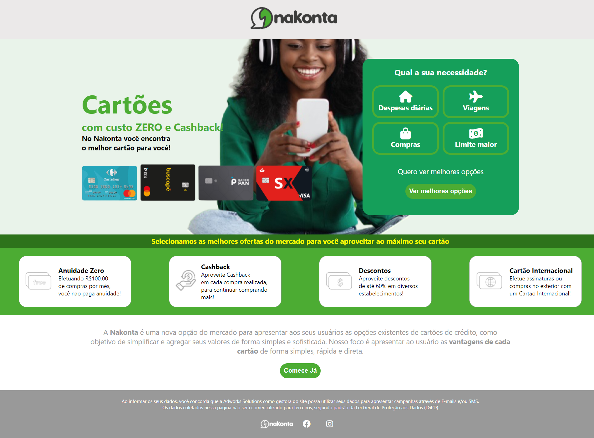

# Frontend do Site Nakonta - Versão Alternativa

Site de Captura de Clientes para usos de cartões de créditos desenvolvido em um Freela. Desenvolvi duas versões, a primeira pode ser acessada [aqui](https://github.com/Drlazinho/site-nakonta).

## Detalhes do Projeto Entregue
* HTML5;
* CSS3 Interno e Inline;
* FontAwesome para ícones;
* Responsive Web;
* Javascript

A estilização e a lógica foi em escopo interno. Separei externamente para fins didáticos.

## Resultado
[Site Nakonta](https://site-nakonta-version-alternative.vercel.app/)

## Colaboradores
<table>
  <tr>
    <td align="center">
      <a href="#">
         
        
          <b>Lázaro Pimentel</b>
        
      </a>
    </td>
  </tr>
</table>

## Licença
The MIT License (MIT)

Copyright ©️ 2022 - Lázaro Pimentel
